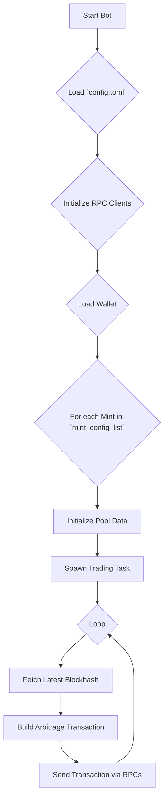
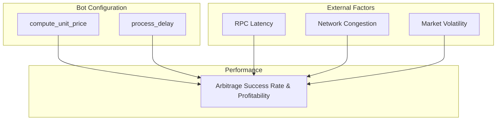
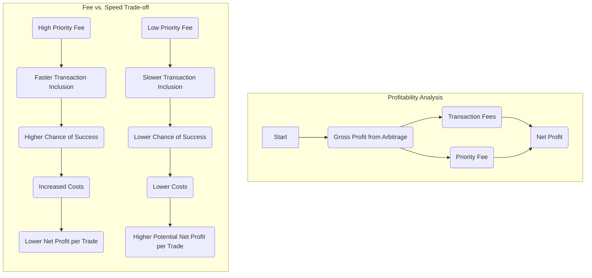
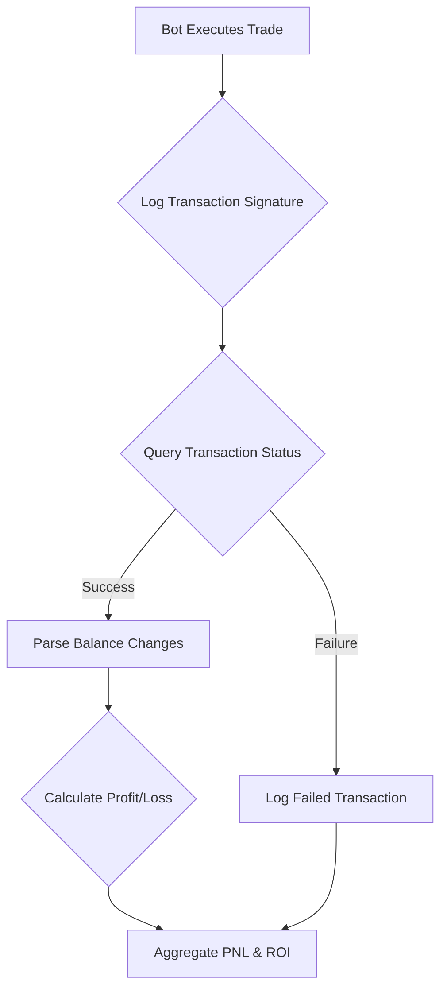

# Solana MEV Bot - Advanced Flashloan & Arbitrage Trading Bot

A high-performance, flash-loan-integrated MEV (Maximal Extractable Value) (https://t.me/i3visioo) arbitrage bot for the Solana blockchain. This professional-grade Solana trading bot is engineered to identify and execute profitable arbitrage opportunities across a wide range of decentralized exchanges (DEXs). Our Solana flashloan bot leverages Kamino Finance flash loans to maximize capital efficiency, making it one of the most advanced Solana arbitrage bots available. This Rust-based MEV bot solution is designed for serious traders seeking automated profit generation through cross-DEX arbitrage on the Solana network.

## Contact Information

- **Discord**: [@i3visio](https://discord.gg/XtbzXGtKDs)
- **Telegram**: [@i3visioo](https://t.me/i3visioo)
- **Email**: [i3visio89@gmail.com](mailto:i3visio89@gmail.com)

## Overview

The Solana Arbitrage Bot (https://t.me/i3visioo) is a sophisticated MEV trading bot framework designed for executing complex arbitrage strategies on the Solana network. This advanced Solana trading bot operates by continuously monitoring price discrepancies of token pairs across various decentralized exchanges (DEXs) and executing atomic, multi-leg trades to capitalize on these differences. As a powerful Solana flashloan bot, the integration of flash loans from Kamino Finance allows the bot to leverage significant capital without requiring large upfront investments, maximizing profitability and ROI potential.

This professional Solana arbitrage bot is engineered for automated trading, utilizing sophisticated algorithms to identify profitable opportunities across multiple liquidity pools. The bot supports cross-DEX arbitrage, enabling traders to profit from price differences between Raydium, Orca, Meteora, Pump AMM, and other major Solana DEXs. Whether you're looking for a Solana MEV bot, Solana flashloan bot, Solana trading bot, or Solana arbitrage bot, this comprehensive solution provides all the features needed for successful automated trading on the Solana blockchain.

Key features of this Solana MEV bot include:
- **Flashloan Integration**: Leverage Kamino Finance flash loans for capital-efficient arbitrage trading
- **Multi-DEX Support**: Monitor and trade across multiple Solana decentralized exchanges simultaneously
- **High-Speed Execution**: Optimized transaction building and submission for maximum success rates
- **Automated Trading**: Fully automated Solana trading bot that requires minimal manual intervention
- **Advanced MEV Strategies**: Sophisticated arbitrage detection and execution algorithms

This tool is intended for experienced developers and quantitative traders with a strong understanding of blockchain technology, DeFi protocols, MEV strategies, and Solana network mechanics.

## Why Choose This Solana MEV Bot?

When searching for the best Solana arbitrage bot, Solana flashloan bot, or Solana trading bot, this solution stands out with its comprehensive feature set:

- **Advanced MEV Bot Architecture**: Built specifically for Solana blockchain, this MEV bot leverages cutting-edge technology to extract maximum value from on-chain opportunities
- **Flashloan Integration**: Unlike basic trading bots, this Solana flashloan bot integrates seamlessly with Kamino Finance, allowing you to trade with borrowed capital that's repaid within the same transaction
- **Multi-Strategy Support**: This Solana arbitrage bot supports various arbitrage strategies including cross-DEX arbitrage, triangular arbitrage, and flash loan arbitrage
- **Professional Trading Bot Features**: As a complete Solana trading bot solution, it includes transaction spam prevention, compute unit optimization, and multi-RPC support for maximum reliability
- **Automated Execution**: Set up once and let your Solana MEV bot run 24/7, automatically identifying and executing profitable trades without manual intervention
- **Rust Performance**: Built in Rust for maximum speed and efficiency, critical for MEV bot operations where milliseconds matter

Whether you're looking for a Solana MEV bot, Solana flashloan bot, Solana trading bot, or Solana arbitrage bot, this solution provides enterprise-grade functionality for serious traders and developers.

**Disclaimer:** This is an advanced trading tool that carries significant financial risk. The authors and contributors are not liable for any financial losses. Use this software at your own risk.

## Architecture Diagram

The following diagram illustrates the bot's operational flow:



## How It Works: The Solana MEV Bot Lifecycle

This Solana arbitrage bot operates through a structured, asynchronous lifecycle, designed for high performance and reliability. Understanding how this Solana trading bot works is essential for maximizing its potential as a profitable MEV bot solution. The Solana flashloan bot's workflow ensures optimal execution of arbitrage opportunities while minimizing risk and maximizing capital efficiency.

1.  **Configuration Loading**: Upon launch, the bot reads the `config.toml` file to load its operational parameters, including the user's wallet, RPC endpoints, and the list of token mints to be arbitraged.

2.  **Initialization**: It establishes connections to the specified Solana RPC endpoints. The main RPC is used for fetching on-chain data, while a separate list of RPCs can be configured for spamming transactions to increase the chances of fast execution.

3.  **Wallet and ATA Setup**: The bot loads the user's keypair and, for each configured mint, it checks for the existence of an Associated Token Account (ATA). If an ATA is not found, the bot automatically creates it.

4.  **Pool Data Initialization**: For each mint, the bot fetches and parses the on-chain data for all the pools listed in the configuration. This includes pools from all supported DEXs. This data is stored in memory for quick access.

5.  **Blockhash Refreshing**: A background task is spawned to periodically refresh the latest blockhash. This is crucial for ensuring that transactions are submitted with a recent and valid blockhash.

6.  **Trading Loop**: For each configured mint, a separate asynchronous task is spawned. This core component of the Solana arbitrage bot enters an infinite loop to continuously perform the following steps:
    *   **Build Transaction**: It constructs a single, atomic transaction that executes the arbitrage strategy. This transaction is a cross-program invocation (CPI) to a dedicated on-chain program (`MEViEnscUm6tsQRoGd9h6nLQaQspKj7DB2M5FwM3Xvz`) that handles the multi-leg swaps and flash loan execution. The Solana MEV bot's transaction builder ensures all trades are executed atomically, either succeeding completely or failing without partial execution.
    *   **Send Transaction**: The transaction is signed and sent to the Solana network through the configured RPC endpoints. If spam mode is enabled, this Solana trading bot sends the transaction through multiple RPCs simultaneously to increase the probability of successful inclusion in a block. This is crucial for the Solana flashloan bot's success rate.
    *   **Delay**: The loop then waits for a configurable delay before starting the next iteration, allowing the Solana arbitrage bot to balance between frequency of attempts and network resources.

## Technical Deep Dive

This section provides an in-depth look at the technical architecture of the Solana MEV bot. Understanding these components is essential for optimizing the performance of your Solana trading bot, Solana flashloan bot, or Solana arbitrage bot setup.

### Transaction Builder (`src/transaction.rs`)

The `build_and_send_transaction` function is the heart of this Solana arbitrage bot's trading logic. It orchestrates the creation and submission of arbitrage transactions, ensuring the Solana MEV bot can execute complex multi-leg trades efficiently.

-   **Instruction Assembly**: The function assembles a list of instructions to be included in the transaction. This always includes `ComputeBudget` instructions to set the compute unit limit and price, which helps with transaction prioritization.
-   **On-Chain Program Invocation**: The core of the transaction is a single instruction that calls the on-chain executor program. This program is responsible for executing the entire arbitrage strategy atomically. The instruction is packed with all the necessary account metadata for every pool involved in the arbitrage path.
-   **Versioned Transactions**: The bot uses Versioned Transactions with Address Lookup Tables (ALTs) to efficiently pack the large number of accounts required for multi-DEX swaps into a single transaction.

### Pool Data Refresh (`src/refresh.rs`)

The `initialize_pool_data` function is responsible for preparing the bot to trade on a given set of pools.

-   **On-Chain Data Fetching**: For each pool address provided in the configuration, this function fetches the account data from the Solana network.
-   **Data Deserialization**: It then deserializes the raw account data into structured objects that represent the state of each pool. Each DEX has its own data structures and deserialization logic.
-   **Data Aggregation**: All the parsed pool data for a given mint is aggregated into a `MintPoolData` object, which is then used by the transaction builder.

## Supported DEXs - Multi-Exchange Arbitrage Support

This Solana MEV bot integrates with a comprehensive list of Solana's top decentralized exchanges, enabling sophisticated cross-DEX arbitrage strategies. The Solana arbitrage bot monitors price differences across all these platforms simultaneously, identifying profitable trading opportunities that a Solana flashloan bot can execute atomically. The Solana trading bot's multi-DEX support is essential for maximizing arbitrage opportunities:

-   **Pump AMM**
-   **Raydium**: V4, Constant Product (CPMM), and Concentrated Liquidity (CLMM)
-   **Meteora**: Dynamic Liquidity Market Maker (DLMM), Dynamic AMM, and DAMM V2
-   **Orca**: Whirlpool (Concentrated Liquidity)
-   **SolFi**
-   **Vertigo**

## Performance, PNL, and ROI - Optimizing Your Solana MEV Bot

Understanding and optimizing your Solana trading bot's performance is critical for achieving profitability. Whether you're running a Solana arbitrage bot, Solana flashloan bot, or Solana MEV bot, this section provides a deeper look into the factors influencing performance and how to approach PNL and ROI analysis. Maximizing the efficiency of your automated trading strategy requires careful tuning of all performance parameters.

### Performance Tuning - Maximizing Your Solana Trading Bot Success Rate

The success of an arbitrage trade executed by your Solana MEV bot is a race against time. The Solana arbitrage bot's ability to quickly identify an opportunity, build a transaction, and have it included in a block before the opportunity disappears is paramount. For a Solana flashloan bot, speed is especially critical since flash loans must be repaid within the same transaction, leaving no margin for error or delay. Optimizing your Solana trading bot's performance involves balancing multiple factors to achieve maximum profitability.

The following diagram illustrates the key factors that influence the bot's performance:



-   **RPC Provider**: The quality of your RPC provider is arguably the most critical factor for your Solana MEV bot's success. A low-latency, high-reliability RPC endpoint ensures that your Solana trading bot receives on-chain data quickly and can submit arbitrage transactions with minimal delay. For a Solana flashloan bot, RPC latency directly impacts profitability since flash loan arbitrage opportunities are extremely time-sensitive.
-   **Network Conditions**: High network congestion on Solana can lead to longer transaction confirmation times and increase the likelihood of your Solana arbitrage bot's transaction being dropped. The Solana MEV bot must adapt to network conditions to maintain optimal performance.
-   **Market Volatility**: While volatility creates arbitrage opportunities for your Solana trading bot, it also means that those opportunities are fleeting. The Solana arbitrage bot must be able to act within milliseconds to capitalize on price discrepancies before they disappear. A well-tuned Solana flashloan bot can exploit these volatile conditions more effectively than traditional trading methods.
-   **`compute_unit_price`**: This setting determines the priority of your Solana MEV bot's transactions. A higher price increases the chance that a block leader will include your transaction, which is crucial for successful arbitrage execution. However, it also reduces net profit per trade. Finding the optimal balance is key to maximizing your Solana trading bot's ROI.

#### The `compute_unit_price` Trade-off

Setting the `compute_unit_price` is a delicate balancing act. The following diagram illustrates the trade-off between paying for priority and maximizing net profit.



### PNL and ROI Analysis - Tracking Your Solana MEV Bot Performance

**This Solana MEV bot is a trade execution engine and does not have built-in PNL or ROI tracking.** To effectively measure your Solana trading bot's profitability, whether you're running a Solana arbitrage bot or Solana flashloan bot, you must implement a separate monitoring and analysis solution. Tracking performance metrics is essential for optimizing your automated trading strategy and ensuring long-term profitability.

The following diagram outlines a recommended workflow for tracking PNL:



A practical approach to implementing this workflow would be:

1.  **Logging**: Modify the bot to log every transaction signature to a database or a file.
2.  **Data Fetcher**: Create a separate script that periodically reads the transaction logs.
3.  **On-Chain Verification**: For each signature, use the Solana RPC `getTransaction` method to fetch the transaction details.
4.  **Balance Parsing**: Analyze the `preTokenBalances` and `postTokenBalances` fields in the transaction metadata to determine the exact change in your token balances.
5.  **Profit Calculation**: Convert the token balance changes to a common currency (e.g., USDC) to calculate the net profit or loss for each trade.
6.  **Aggregation**: Store the results in a database to track your overall PNL and ROI over time.

## Getting Started - Setting Up Your Solana MEV Bot

This guide will help you set up and configure your Solana arbitrage bot, Solana flashloan bot, or Solana trading bot. Whether you're new to MEV bots or an experienced trader, following these steps will get your automated trading system up and running on the Solana blockchain.

### Prerequisites

Before deploying your Solana MEV bot, ensure you have:
-   [Rust and Cargo](https://www.rust-lang.org/tools/install) installed (required for compiling the Solana trading bot).
-   A Solana wallet with sufficient SOL to cover transaction fees and potential flash loan costs.
-   Understanding of Solana network mechanics, DeFi protocols, and arbitrage trading strategies.

### Installation & Setup

1.  **Clone the Repository:**
    Clone the Solana MEV bot repository to get started with your automated trading setup:
    ```bash
    git clone https://github.com/i3visio/solana-mev-bot.git
    cd solana-mev-bot
    ```

2.  **Configure the Bot:**
    Configure your Solana arbitrage bot by creating a `.env` file with your credentials. This Solana trading bot requires proper configuration to execute profitable trades:
    ```bash
    cp .env.example .env
    ```
    Then, add your RPC endpoint and wallet private key. Proper RPC configuration is essential for your Solana flashloan bot's performance.

3.  **Run the Bot:**
    Launch your Solana MEV bot to start automated arbitrage trading:
    ```bash
    cargo run
    ```

Once running, your Solana arbitrage bot will begin monitoring for profitable trading opportunities across multiple DEXs, executing trades automatically when arbitrage opportunities are detected.

### `[bot]` - Solana MEV Bot Core Configuration

These settings control the core behavior of your Solana trading bot. Proper configuration is essential for optimal performance of your Solana arbitrage bot and Solana flashloan bot operations.

-   `compute_unit_limit`: The maximum number of compute units the Solana MEV bot's transaction is allowed to consume. This limit is critical for ensuring your Solana trading bot's transactions don't fail due to resource constraints during complex multi-leg arbitrage executions.
    -   **Type**: `integer`
    -   **Default**: `600000`

### `[[routing.mint_config_list]]` - Configuring Arbitrage Routes

This is an array of tables, where each table configures the arbitrage route for a specific token mint. Your Solana arbitrage bot uses these routes to identify profitable trading opportunities across multiple DEXs. The Solana MEV bot will monitor these configured routes continuously, executing trades when arbitrage opportunities are detected.

-   `mint`: The address of the token mint you want to arbitrage (e.g., USDC, USDT).
    -   **Type**: `string`
-   `*_pool_list`: A list of pool addresses for each supported DEX (e.g., `raydium_pool_list`, `pump_pool_list`).
    -   **Type**: `array of strings`
-   `lookup_table_accounts`: A list of Address Lookup Table (ALT) accounts to use for this route.
    -   **Type**: `array of strings`
-   `process_delay`: The delay in milliseconds between each trading attempt for this mint.
    -   **Type**: `integer`

### `[rpc]` - RPC Configuration for Your Solana Trading Bot

RPC configuration is critical for your Solana MEV bot's performance. A high-quality, low-latency RPC provider is essential for successful arbitrage execution. Your Solana arbitrage bot relies on RPC endpoints to fetch real-time on-chain data and submit transactions quickly.

-   `url`: The primary RPC URL for fetching on-chain data. Choose a reliable, fast RPC provider to ensure your Solana flashloan bot can execute trades with minimal latency. Low-latency RPCs significantly improve your Solana trading bot's success rate.
    -   **Type**: `string`

### `[spam]` - Multi-RPC Transaction Spamming

Transaction spamming is a powerful feature that increases your Solana MEV bot's chances of successful transaction inclusion. By sending transactions through multiple RPCs simultaneously, your Solana arbitrage bot can improve its success rate, which is especially important for time-sensitive flash loan arbitrage opportunities.

-   `enabled`: Set to `true` to enable sending transactions through multiple RPCs simultaneously. This feature is recommended for production Solana trading bot deployments where maximum transaction success rate is critical.
    -   **Type**: `boolean`
-   `sending_rpc_urls`: A list of RPC URLs to use for spamming transactions. Configure multiple high-quality RPC endpoints to maximize your Solana flashloan bot's reliability and success rate.
    -   **Type**: `array of strings`
-   `compute_unit_price`: The price to pay per compute unit, in micro-lamports. Higher values give your Solana MEV bot's transactions higher priority, increasing the chance of block inclusion. Finding the optimal balance between priority fees and profitability is key to maximizing your Solana arbitrage bot's ROI.
    -   **Type**: `integer`
-   `max_retries`: The maximum number of times to retry sending a transaction if it fails. This helps improve the reliability of your Solana trading bot in cases of temporary network issues.
    -   **Type**: `integer`

### `[wallet]`

-   `private_key`: Your wallet's private key, either as a base58 encoded string or a path to a keypair file.
    -   **Type**: `string`

### `[kamino_flashloan]`

The Kamino flash loan integration is a powerful feature that transforms this Solana MEV bot into a capital-efficient arbitrage machine. When enabled, your Solana flashloan bot can execute trades using borrowed capital that's automatically repaid within the same transaction, eliminating the need for large capital reserves.

-   `enabled`: Set to `true` to enable the use of Kamino flash loans for arbitrage. When enabled, your Solana arbitrage bot will leverage flash loans to maximize trading opportunities without requiring significant capital. This is essential for maximizing the profitability of your Solana trading bot.
    -   **Type**: `boolean`

**Benefits of Flash Loan Integration for Your Solana MEV Bot:**
- Capital Efficiency: Trade with borrowed funds, repaid atomically
- Increased Opportunities: Access larger arbitrage spreads without upfront capital
- Risk Management: Atomic transactions ensure no partial executions
- Maximized ROI: Trade more frequently with the same capital allocation

## Contact Information

- **Discord**: [@i3visio](https://discord.gg/XtbzXGtKDs)
- **Telegram**: [@i3visioo](https://t.me/i3visioo)
- **Email**: [i3visio89@gmail.com](mailto:i3visio89@gmail.com)
